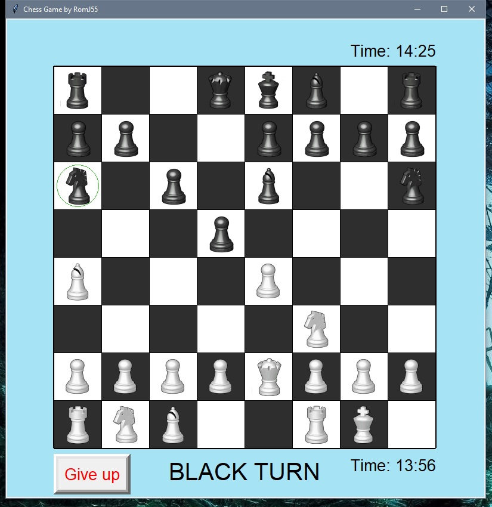

# Chess-Game
Chess game created in python!

Fully functional chess game. Used tkinter for the GUI- no 3rd party modules required!

---------------------------------------------------------------------------------------------------------------------------------

Following the standard chess rules:
  https://en.wikipedia.org/wiki/Rules_of_chess
  

- Time is set to 15 Minutes by default. You can change it by changing the number on line 4 in main.py

---------------------------------------------------------------------------------------------------------------------------------
Not working:
  - en passant moves https://support.chess.com/article/683-what-is-en-passant

---------------------------------------------------------------------------------------------------------------------------------
- Todo in the future:
  - show a Restart game-button when the game ends(need to restart the programm atm)
  - Sounds
  - AI(soon-ish) 
    - could take abit. need to explore minimax algorithm and optimizations(like ab-pruning etc.)

